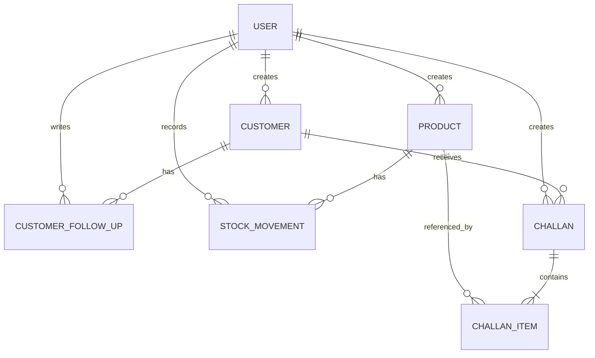

# Step 1 — Requirements, Scope, and Architecture

**Project:** Mini ERP + CRM Operations Portal  
**Document ID:** CASE-STUDY-STEP-01  
**Version:** 1.4  
**Documentation status:** Complete  
**Implementation status:** Complete  
**Date:** 2026-07-28  
**Source assignment:** `Full Stack Developer Case Study (1).pdf`  
**Owner:** Candidate / Project Implementer

---

## 1. Purpose

This document converts the supplied full-stack developer case study into an implementation-ready project baseline. It separates explicit assignment requirements from architecture decisions and assumptions so that later development does not unintentionally expand the scope or alter critical business rules.

The document establishes:

- What must be built.
- What will not be built during the 48-hour assignment.
- The selected application architecture and technology stack.
- The initial domain and database model.
- Role and authorization boundaries.
- The required sales-challan and inventory behavior.
- API and frontend expectations.
- Deployment and submission expectations.
- Testing priorities and the definition of done.

This is the governing document for all later steps unless a change is explicitly recorded in the **Change Log**.

---

## 2. Source-derived assignment summary

### 2.1 Business context

**[SOURCE]** The application is a small ERP/CRM system for a wholesale or distribution company. The organization works with customers, products, stock, purchase orders, sales challans, invoices, and basic CRM follow-ups. The system is intended for internal employees such as sales, warehouse, and accounts teams.

**[SOURCE]** The objective is not to create a large enterprise ERP. The assignment is intended to demonstrate competence in full-stack development, backend APIs, database design, frontend UI, deployment, and a realistic business flow.

### 2.2 Delivery window

**[SOURCE]** The stated deadline is 48 hours from the time the assignment is shared.

### 2.3 Required technology categories

**[SOURCE]** The backend must use:

- Node.js
- TypeScript
- Express.js or NestJS
- PostgreSQL or MySQL
- REST APIs
- Proper validation and error handling

**[SOURCE]** The frontend must use:

- React
- HTML
- CSS
- JavaScript or TypeScript
- Responsive UI

**[SOURCE]** Delivery and engineering expectations include:

- Environment variables
- Documented server setup
- A GitHub repository with proper commits
- A README with setup instructions

### 2.4 Required core modules

**[SOURCE]** Four core modules are explicitly required:

1. Authentication and roles
2. Customer CRM
3. Product and inventory
4. Sales challans

### 2.5 Deployment and submission

**[SOURCE]** Deployment may use a free platform. AWS is optional and treated as bonus work; the candidate is not expected to spend money.

**[SOURCE]** When the system is not deployed, the assignment requires a working local setup, full-flow screen recording, Postman collection, and clear README instructions.

**[SOURCE]** The final submission is expected to contain a repository link, frontend URL, backend API URL, test credentials for all roles, API documentation or Postman collection, setup and deployment instructions, an architecture explanation, and known limitations or incomplete parts.

---

## 3. What the evaluator is likely testing

The assignment explicitly names the technologies and modules, but successful evaluation depends on more than displaying forms. The implementation must show that the candidate can translate business rules into consistent behavior.

The principal evaluation dimensions are expected to be:

1. Correctness of the business flow.
2. Appropriate relational database design.
3. Secure authentication and role enforcement.
4. Clean, validated REST APIs.
5. A usable and responsive React interface.
6. Reliable stock handling and auditability.
7. Clear deployment and setup instructions.
8. Professional repository structure and Git history.
9. Ability to control scope under a 48-hour deadline.
10. Ability to explain assumptions and limitations honestly.

The most important technical path is sales challan confirmation because it connects customers, products, inventory, authorization, transaction safety, error handling, and audit history.

---

## 4. Scope classification

### 4.1 P0 — mandatory for the submission

The following items must work before bonus or cosmetic work begins:

| Area | Mandatory behavior |
|---|---|
| Authentication | JWT login for Admin, Sales, Warehouse, and Accounts users. |
| Authorization | Backend role checks for protected operations; frontend action visibility must match. |
| Customers | Create, edit, list, search, filter, view details, and add follow-up notes. |
| Products | Create, edit, list, search, filter, and display stock and low-stock state. |
| Inventory | Record stock IN/OUT changes and keep a movement log with reason, creator, and timestamp. |
| Challans | Create a challan for one customer with multiple products and quantities. |
| Challan number | Generate a unique challan number automatically. |
| Draft workflow | Save and edit a challan while it is in Draft state without changing stock. |
| Confirmation | Confirm a challan, reduce stock atomically, and prevent stock from becoming negative. |
| Insufficient stock | Reject confirmation with a clear API error and no partial deduction. |
| Product snapshot | Store product information within each challan item rather than relying only on product ID. |
| Cancellation | Support the assignment's Cancelled state with documented behavior. |
| APIs | Validation, appropriate HTTP status codes, clear errors, pagination, search, and filters where needed. |
| Frontend | Clean, responsive admin-style UI for the complete required flow. |
| Seed data | Test users for all four required roles. |
| Documentation | README, architecture explanation, assumptions, known limitations, and API documentation/Postman collection. |
| Delivery | Live deployment or the complete local demonstration package required by the assignment. |

### 4.2 P1 — valuable after P0 is stable

These items improve the submission but must not delay the required flow:

- Dashboard summary cards.
- Low-stock highlighting and filters.
- Follow-up due indicators.
- Swagger/OpenAPI UI.
- Docker Compose for local PostgreSQL and services.
- Focused backend integration tests.
- Seeded demonstration customers, products, stock movements, and challans.
- Polished empty, loading, and error states.

### 4.3 P2 — bonus only

- GitHub Actions.
- Invoice PDF export.
- Product image upload to Amazon S3.
- AWS deployment.
- Additional analytics.

### 4.4 Explicit exclusions for the first submission

The following are intentionally outside the implementation scope:

- Purchase-order management.
- Full invoice management.
- Payment collection or accounting ledgers.
- GST calculation or tax filing logic.
- Multi-company or multi-tenant architecture.
- Full multi-warehouse entities, transfers, and warehouse-level balances.
- User registration.
- Password reset.
- Email verification.
- Refresh-token rotation.
- Approval chains.
- Email, SMS, or push notifications.
- Mobile applications.
- Advanced analytics.
- Product variants.
- Batch, lot, or serial-number tracking.
- Returns and credit-note workflows.
- Offline synchronization.

These exclusions do not contradict the assignment. Purchase orders and invoices appear in the business context, but they are not among the four defined core modules.

---

## 5. Architecture decisions

### 5.1 Selected stack

#### Backend

**[DECISION]** Use:

- Node.js
- TypeScript
- NestJS
- PostgreSQL
- Prisma ORM
- JWT authentication
- bcrypt for password hashing
- NestJS DTO validation with `class-validator` and `class-transformer`
- Swagger/OpenAPI

#### Frontend

**[DECISION]** Use:

- React
- TypeScript
- Vite
- React Router
- TanStack Query
- React Hook Form
- Zod for client-side form schemas
- Material UI

#### Development and delivery

**[DECISION]** Use:

- A monorepo containing `apps/api` and `apps/web`.
- ESLint and Prettier.
- PostgreSQL locally through Docker Compose where possible.
- Postman collection and Swagger documentation.
- Jest or Vitest for focused automated tests.
- Vercel for the frontend, Render or Railway for the API, and Neon PostgreSQL for the recommended free deployment path.

### 5.2 Why NestJS was selected

NestJS is within the assignment's accepted backend options and provides a consistent structure for:

- Modules
- Controllers
- Services
- Guards
- Validation
- Exception handling
- Dependency injection
- Swagger integration
- Automated testing

This reduces architectural uncertainty under a short deadline and makes role enforcement and module ownership clearer than an unstructured Express application.

### 5.3 Why PostgreSQL was selected

PostgreSQL is within the accepted database options and is suitable for:

- Relational domain modeling.
- Transactions.
- Row locking.
- Unique constraints.
- Decimal prices.
- Referential integrity.
- Indexes for filters and search.
- Safe inventory updates.

### 5.4 Why Prisma was selected

Prisma is an implementation choice rather than an assignment requirement. It is selected for:

- Typed database access.
- Fast schema iteration.
- Reproducible migrations.
- Seed support.
- Transaction APIs.
- Reduced boilerplate during a 48-hour build.

Where row-level locking or guarded updates are required, raw SQL may be used inside a controlled transaction if the ORM abstraction is insufficient.

### 5.5 High-level architecture

```text
┌──────────────────────────────────────────────┐
│                React Frontend                │
│                                              │
│ Login                                        │
│ Dashboard                                    │
│ Customers and follow-ups                     │
│ Products and stock movements                 │
│ Draft/confirmed/cancelled challans            │
└──────────────────────┬───────────────────────┘
                       │ HTTPS + JSON REST API
                       ▼
┌──────────────────────────────────────────────┐
│                 NestJS API                   │
│                                              │
│ Auth module                                  │
│ Users module                                 │
│ Customers module                             │
│ Products module                              │
│ Inventory module                             │
│ Challans module                              │
│ Common authorization, validation, and errors │
└──────────────────────┬───────────────────────┘
                       │ Prisma / SQL transaction
                       ▼
┌──────────────────────────────────────────────┐
│                 PostgreSQL                   │
│                                              │
│ Users                                        │
│ Customers                                    │
│ Customer follow-ups                          │
│ Products                                     │
│ Stock movements                              │
│ Challans                                     │
│ Challan items and snapshots                  │
└──────────────────────────────────────────────┘
```

### 5.6 Proposed repository structure

```text
mini-erp-crm/
├── apps/
│   ├── api/
│   │   ├── prisma/
│   │   │   ├── schema.prisma
│   │   │   ├── migrations/
│   │   │   └── seed.ts
│   │   ├── src/
│   │   │   ├── auth/
│   │   │   ├── users/
│   │   │   ├── customers/
│   │   │   ├── products/
│   │   │   ├── inventory/
│   │   │   ├── challans/
│   │   │   ├── common/
│   │   │   ├── app.module.ts
│   │   │   └── main.ts
│   │   └── test/
│   └── web/
│       ├── src/
│       │   ├── api/
│       │   ├── components/
│       │   ├── features/
│       │   │   ├── auth/
│       │   │   ├── customers/
│       │   │   ├── products/
│       │   │   └── challans/
│       │   ├── layouts/
│       │   ├── pages/
│       │   ├── routes/
│       │   └── main.tsx
│       └── public/
├── docs/
│   ├── case-study/
│   ├── postman/
│   ├── screenshots/
│   └── architecture/
├── docker-compose.yml
├── .env.example
├── package.json
└── README.md
```

---

## 6. Role and permission model

### 6.1 Required roles

**[SOURCE]** The application must have:

- Admin
- Sales
- Warehouse
- Accounts

### 6.2 Selected permission matrix

The assignment does not define exact permissions for each role. The following matrix is a project decision designed around realistic internal responsibilities.

| Action | Admin | Sales | Warehouse | Accounts |
|---|---:|---:|---:|---:|
| Log in | Yes | Yes | Yes | Yes |
| View customers | Yes | Yes | Yes | Yes |
| Add or edit customers | Yes | Yes | No | No |
| Add customer follow-up notes | Yes | Yes | No | No |
| View products | Yes | Yes | Yes | Yes |
| Add or edit products | Yes | No | Yes | No |
| Record manual stock IN/OUT | Yes | No | Yes | No |
| View stock movements | Yes | Yes | Yes | Yes |
| Create challans | Yes | Yes | No | No |
| Edit draft challans | Yes | Yes | No | No |
| Confirm challans | Yes | Yes | No | No |
| Cancel draft challans | Yes | Yes | No | No |
| Cancel confirmed challans | Yes | No | No | No |
| View challans | Yes | Yes | Yes | Yes |

### 6.3 Authorization rules

- Backend guards are authoritative.
- Frontend action hiding is only a usability feature and not a security boundary.
- The JWT contains the user ID and role.
- Disabled users cannot log in.
- No public registration route is provided.
- Four assessment accounts are seeded.
- Passwords are stored only as hashes.
- Secrets and seed passwords are supplied through environment variables.

### 6.4 Proposed seeded users

```text
admin@example.com
sales@example.com
warehouse@example.com
accounts@example.com
```

Passwords must not be committed. Assessment credentials may be documented in the submission notes or provided through safe environment configuration.

---

## 7. Domain and data model

The exact Prisma schema will be finalized in Step 2. This section locks the conceptual model and critical constraints.

### 7.1 User

```text
users
-----
id
name
email
password_hash
role
is_active
created_at
updated_at
```

Constraints:

- Email is unique.
- Role is one of `ADMIN`, `SALES`, `WAREHOUSE`, or `ACCOUNTS`.
- `is_active` defaults to true.

### 7.2 Customer

**[SOURCE]** A customer includes:

- Customer name
- Mobile number
- Email
- Business name
- Optional GST number
- Customer type: Retail, Wholesale, Distributor
- Address
- Status: Lead, Active, Inactive
- Follow-up date
- Notes

Proposed conceptual table:

```text
customers
---------
id
name
mobile_number
email
business_name
gst_number
customer_type
address
status
follow_up_date
notes
created_by_id
created_at
updated_at
```

Suggested indexes:

- Name
- Mobile number
- Business name
- Customer type
- Status
- Follow-up date

### 7.3 Customer follow-up

**[DECISION]** Keep follow-up history in a separate immutable record rather than overwriting one notes field.

```text
customer_follow_ups
-------------------
id
customer_id
note
next_follow_up_date
created_by_id
created_at
```

The customer record retains a current `follow_up_date`, while follow-up entries form a chronological CRM timeline.

### 7.4 Product

**[SOURCE]** A product includes:

- Product name
- SKU/code
- Category
- Unit price
- Current stock
- Minimum stock alert quantity
- Location/warehouse

Conceptual table:

```text
products
--------
id
name
sku
category
unit_price
current_stock
minimum_stock_alert_quantity
warehouse_location
is_active
created_by_id
created_at
updated_at
```

Constraints:

- SKU is unique.
- Unit price is non-negative.
- Current stock is non-negative.
- Minimum-stock quantity is non-negative.
- Monetary values use a decimal database type, not floating-point.

### 7.5 Stock movement

**[SOURCE]** The movement log must track product, quantity changed, IN or OUT, reason, creator, and timestamp.

**[DECISION]** Add balance and reference fields to make the audit trail clearer.

```text
stock_movements
---------------
id
product_id
movement_type
quantity
reason
balance_before
balance_after
reference_type
reference_id
created_by_id
created_at
```

Movement types:

```text
IN
OUT
```

Reference types:

```text
OPENING_STOCK
MANUAL_ADJUSTMENT
CHALLAN_CONFIRMATION
CHALLAN_CANCELLATION
```

Rules:

- `quantity` is always positive.
- Direction is represented by movement type.
- Movement records are immutable.
- Every stock change creates a movement record.
- A product created with opening stock produces an opening-stock IN movement.

### 7.6 Challan

**[SOURCE]** The challan contains a number, customer, products, total quantity, status, creator, and created date. Supported statuses are Draft, Confirmed, and Cancelled.

Conceptual table:

```text
challans
--------
id
sequence_number
challan_number
customer_id
status
total_quantity
created_by_id
confirmed_by_id
cancelled_by_id
created_at
updated_at
confirmed_at
cancelled_at
cancellation_reason
```

Constraints:

- Challan number is unique.
- Total quantity is non-negative.
- Confirmed and cancelled challans cannot be edited.

### 7.7 Challan item

**[SOURCE]** The challan must store product snapshot data, not only product ID.

```text
challan_items
-------------
id
challan_id
product_id
product_name_snapshot
product_sku_snapshot
product_category_snapshot
unit_price_snapshot
warehouse_location_snapshot
quantity
line_total
created_at
```

The product relationship remains for traceability, while snapshot columns preserve historical data if the source product is later renamed, moved, deactivated, or repriced.

The server calculates:

```text
line_total = unit_price_snapshot × quantity
total_quantity = sum(challan item quantities)
```

Client-provided totals are never treated as authoritative.

### 7.8 Relationship overview



---

## 8. Challan lifecycle and business rules

### 8.1 State model

```text
DRAFT ───────────────► CONFIRMED
  │                       │
  │                       │ Admin cancellation
  └───────────────► CANCELLED
```

### 8.2 Locked lifecycle rules

1. A draft challan does not affect stock.
2. A draft challan may be edited.
3. A confirmed challan cannot be edited.
4. A cancelled challan cannot be edited.
5. Confirmation deducts stock exactly once.
6. A second confirmation attempt returns a conflict response.
7. Confirmation succeeds only when every line has sufficient stock.
8. Failure for any line rolls back the complete confirmation.
9. Cancelling a draft challan does not change stock.
10. **[ASSUMPTION]** Cancelling a confirmed challan restores stock through new IN movement records.
11. **[ASSUMPTION]** Only Admin may cancel a confirmed challan.
12. **[ASSUMPTION]** A cancellation reason is required for confirmed challans.
13. Cancelled challans are not restored to Draft or Confirmed.

The assignment defines the Cancelled status but does not define stock behavior. Stock restoration is chosen to maintain inventory consistency and will be documented as an assumption in the final README.

---

## 9. Critical stock-confirmation transaction

### 9.1 Consistency requirement

**[SOURCE]** When a challan is confirmed, stock must be reduced. Stock must not become negative. Insufficient stock must produce a proper API error.

### 9.2 Unsafe approach that must not be used

```text
Read current stock
Check requested quantity
Write reduced stock
```

This sequence can oversell when two confirmations execute concurrently.

### 9.3 Required safe transaction

The confirmation operation must run as one atomic database transaction:

```text
1. Start transaction.
2. Lock or conditionally claim the draft challan.
3. Verify the challan is still DRAFT.
4. Load and lock all referenced products in deterministic ID order.
5. Validate that every product exists and is active.
6. Validate every requested quantity.
7. Compare requested and available stock for every line.
8. If any line is insufficient, roll back the complete transaction.
9. Deduct each stock quantity using a guarded update.
10. Insert one OUT stock movement for each item.
11. Mark the challan CONFIRMED.
12. Record confirmer and confirmation timestamp.
13. Commit.
```

Conceptual SQL:

```sql
BEGIN;

SELECT id, current_stock
FROM products
WHERE id IN (...)
ORDER BY id
FOR UPDATE;

-- Validate all requested quantities before making any change.

UPDATE products
SET current_stock = current_stock - :quantity
WHERE id = :product_id
  AND current_stock >= :quantity;

-- Verify one row was updated for every product.
-- Insert movement records.
-- Update challan only if it is still DRAFT.

COMMIT;
```

Rows are locked in deterministic order to reduce deadlock risk.

### 9.4 Insufficient-stock response

Recommended HTTP behavior:

```http
HTTP/1.1 409 Conflict
Content-Type: application/json
```

```json
{
  "error": {
    "code": "INSUFFICIENT_STOCK",
    "message": "One or more products do not have sufficient stock.",
    "details": [
      {
        "productId": "product-id",
        "sku": "SKU-001",
        "productName": "Product A",
        "requestedQuantity": 12,
        "availableQuantity": 7
      }
    ]
  }
}
```

No stock value or movement record may change when the transaction fails.

---

## 10. Automatic challan numbering

### 10.1 Required behavior

**[SOURCE]** Challan numbers must be generated automatically.

### 10.2 Selected design

Do not use `MAX(challan_number) + 1`, because simultaneous requests may generate duplicates.

Use a database-backed numeric sequence and format it as:

```text
CH-2026-000001
CH-2026-000002
CH-2026-000003
```

Proposed flow:

```text
1. Obtain a unique sequence value from the database.
2. Format the numeric value to six digits.
3. Add the current year and CH prefix.
4. Persist the unique formatted number.
```

The exact implementation will be finalized in Step 2 after evaluating Prisma migration behavior and PostgreSQL sequence options.

---

## 11. REST API baseline

### 11.1 Base path

```text
/api/v1
```

### 11.2 Authentication

| Method | Endpoint | Purpose |
|---|---|---|
| POST | `/auth/login` | Authenticate a seeded user and return a JWT. |
| GET | `/auth/me` | Return the authenticated user's profile and role. |

### 11.3 Customers

| Method | Endpoint | Purpose |
|---|---|---|
| GET | `/customers` | Paginated, searchable, filterable customer list. |
| POST | `/customers` | Create a customer. |
| GET | `/customers/:id` | Return customer detail. |
| PATCH | `/customers/:id` | Update a customer. |
| GET | `/customers/:id/follow-ups` | Return chronological follow-up history. |
| POST | `/customers/:id/follow-ups` | Add a follow-up note. |

Example queries:

```text
GET /customers?page=1&limit=20
GET /customers?search=acme
GET /customers?status=LEAD
GET /customers?customerType=WHOLESALE
GET /customers?followUpFrom=2026-07-28&followUpTo=2026-08-05
```

### 11.4 Products and inventory

| Method | Endpoint | Purpose |
|---|---|---|
| GET | `/products` | Paginated product list. |
| POST | `/products` | Create a product and optional opening-stock movement. |
| GET | `/products/:id` | Return product detail. |
| PATCH | `/products/:id` | Update non-stock product data. |
| GET | `/products/:id/stock-movements` | Return movement history for one product. |
| POST | `/products/:id/stock-movements` | Record a manual IN or OUT adjustment. |
| GET | `/stock-movements` | Return global movement history. |

Example queries:

```text
GET /products?search=laptop
GET /products?category=Electronics
GET /products?warehouse=Main
GET /products?lowStock=true
GET /stock-movements?movementType=OUT
```

### 11.5 Challans

| Method | Endpoint | Purpose |
|---|---|---|
| GET | `/challans` | Paginated, searchable, filterable challan list. |
| POST | `/challans` | Create a draft challan. |
| GET | `/challans/:id` | Return challan details and item snapshots. |
| PATCH | `/challans/:id` | Edit a draft challan. |
| POST | `/challans/:id/confirm` | Confirm and deduct stock atomically. |
| POST | `/challans/:id/cancel` | Cancel a draft or confirmed challan according to authorization rules. |

Example queries:

```text
GET /challans?status=DRAFT
GET /challans?status=CONFIRMED
GET /challans?customerId=...
GET /challans?from=2026-07-01&to=2026-07-31
GET /challans?search=CH-2026-000001
```

The exact request and response schemas will be defined in Step 2.

---

## 12. API response and error conventions

### 12.1 Paginated list

```json
{
  "data": [
    {
      "id": "customer-id",
      "name": "ABC Traders"
    }
  ],
  "meta": {
    "page": 1,
    "limit": 20,
    "total": 61,
    "totalPages": 4
  }
}
```

### 12.2 Single resource

```json
{
  "data": {
    "id": "customer-id",
    "name": "ABC Traders"
  }
}
```

### 12.3 Error envelope

```json
{
  "error": {
    "code": "PRODUCT_SKU_ALREADY_EXISTS",
    "message": "A product with SKU SKU-001 already exists.",
    "details": null
  }
}
```

### 12.4 HTTP status guidance

| Status | Usage |
|---:|---|
| 200 | Successful read or update. |
| 201 | Resource created. |
| 204 | Successful operation with no response body. |
| 400 | Invalid input or malformed request. |
| 401 | Missing, invalid, or expired authentication. |
| 403 | Authenticated user lacks permission. |
| 404 | Resource not found. |
| 409 | Duplicate value, invalid lifecycle transition, or insufficient stock. |
| 500 | Unexpected server failure. |

The global exception layer must avoid exposing stack traces, SQL fragments, JWT secrets, or internal environment values.

---

## 13. Validation baseline

### 13.1 Customer

- Customer name is required.
- Mobile number is required.
- Email is required and must be valid.
- Business name is required.
- GST number is optional.
- Customer type must be Retail, Wholesale, or Distributor.
- Status must be Lead, Active, or Inactive.
- Address is required.
- Follow-up date must be valid when supplied.
- Notes must have a defined maximum length.

The assignment explicitly marks only GST number as optional. The implementation therefore treats the remaining listed fields as required unless a later documented usability decision changes that rule.

### 13.2 Product

- Name is required.
- SKU is required, normalized, and unique.
- Category is required.
- Unit price must be non-negative.
- Opening stock must be non-negative.
- Minimum-stock alert quantity must be non-negative.
- Warehouse/location is required.
- Current stock cannot be changed through an ordinary product edit request.

### 13.3 Stock movement

- Quantity must be a positive integer.
- Movement type must be IN or OUT.
- Reason is required.
- An OUT movement must not produce negative stock.
- Creator and timestamp are server-controlled.
- Existing movement records cannot be edited or deleted.

### 13.4 Challan

- Customer must exist.
- At least one product item is required.
- Every quantity must be a positive integer.
- Duplicate product lines are rejected or normalized consistently.
- Every product must exist and be active.
- Total quantity and line totals are server-calculated.
- Snapshot fields are copied from server-side product records.
- Only a Draft challan may be edited or confirmed.
- Confirmation validates all stock before committing any deduction.
- A challan cannot be confirmed or cancelled twice.

---

## 14. Frontend information architecture

### 14.1 Routes

```text
/login
/dashboard

/customers
/customers/new
/customers/:id
/customers/:id/edit

/products
/products/new
/products/:id
/products/:id/edit

/challans
/challans/new
/challans/:id
/challans/:id/edit

/403
/404
```

### 14.2 Dashboard

The dashboard remains intentionally small:

- Total customers
- Active customers
- Leads requiring follow-up
- Total products
- Low-stock products
- Draft challans
- Confirmed challans

### 14.3 Customer detail

- Customer identity and business data
- Customer type and status
- Current follow-up date
- General notes
- Follow-up timeline
- Add-follow-up form
- Related challan history

### 14.4 Product detail

- Product identity and pricing
- Current stock
- Minimum-stock threshold
- Low-stock warning
- Manual stock IN/OUT action for authorized users
- Stock movement timeline

### 14.5 Challan create/edit

- Customer search and selection
- Product search and selection
- Multiple line items
- Quantity entry
- Available-stock display
- Item removal
- Total quantity
- Informational total amount based on snapshot price
- Save Draft action
- Confirm action

The frontend may display warnings before confirmation, but all stock validation remains authoritative on the server.

### 14.6 Role-aware user interface

- Unauthorized navigation items may be hidden.
- Unauthorized buttons must be hidden or disabled with a clear explanation.
- Direct navigation to a forbidden route must render a 403 state or redirect safely.
- The frontend must still handle a backend 403 because UI restrictions are not security enforcement.

---

## 15. Security baseline

### 15.1 Authentication

- Passwords are hashed with bcrypt.
- JWT signing secret is stored only in environment variables.
- Tokens have a reasonable expiration time.
- Login errors do not reveal whether the email or password was incorrect.
- Disabled users cannot authenticate.

### 15.2 Authorization

- A reusable backend role guard protects restricted endpoints.
- Service-layer checks enforce lifecycle and ownership-independent business rules.
- Frontend role checks mirror, but never replace, backend authorization.

### 15.3 Input and output safety

- DTO validation rejects unexpected or malformed input.
- IDs are validated before database access.
- Database uniqueness constraints back application validation.
- API errors do not expose stack traces or internal query text.
- Search parameters have sensible maximum lengths.
- Pagination limits have an enforced maximum.

### 15.4 Operational safety

- `.env` files are ignored by Git.
- `.env.example` contains names and safe sample values only.
- CORS is limited to configured frontend origins.
- Production logs exclude passwords, tokens, and secrets.
- Database migrations are run explicitly during deployment.

### 15.5 Scope-limited security decision

**[ASSUMPTION]** A single JWT access token is acceptable for this assessment because the assignment explicitly allows simple JWT authentication. Refresh-token rotation, token revocation infrastructure, MFA, and password recovery are outside the 48-hour core scope and must be listed as future improvements rather than silently omitted.

---

## 16. Testing strategy

The project does not need broad low-value coverage. It needs focused verification of business-critical behavior.

### 16.1 Authentication and authorization

- Correct credentials return a JWT.
- Incorrect credentials return 401.
- A disabled user cannot log in.
- Sales cannot record manual stock adjustments.
- Warehouse cannot create a challan.
- Accounts cannot edit customers.
- Admin can perform all protected actions.

### 16.2 Customers

- Create a valid customer.
- Reject missing required fields.
- Search by customer name.
- Search by mobile number.
- Filter by status and customer type.
- Add a follow-up note.
- Return follow-up history in chronological order.

### 16.3 Products and inventory

- Create a product with a unique SKU.
- Reject a duplicate SKU.
- Opening stock creates an IN movement.
- Manual IN increases stock and records before/after balances.
- Valid manual OUT decreases stock.
- Excess manual OUT returns 409.
- A failed movement does not create a movement record.
- Direct product edit cannot alter current stock.

### 16.4 Challans

- Draft creation does not alter stock.
- Draft editing does not alter stock.
- Confirmation deducts the correct quantities.
- Confirmation creates one OUT movement per item.
- Confirmation stores product snapshot values.
- Confirmation calculates total quantity on the server.
- Insufficient stock rolls back the complete transaction.
- A second confirmation does not deduct stock again.
- A confirmed challan cannot be edited.
- Cancelling a draft does not alter stock.
- Admin cancellation of a confirmed challan restores stock once.
- Concurrent confirmations cannot oversell the same product.

### 16.5 Highest-priority automated tests

```text
1. Insufficient stock causes a complete rollback.
2. Concurrent confirmations cannot create negative stock.
3. Confirming the same challan twice deducts stock only once.
4. Cancelling a confirmed challan restores stock only once.
```

---

## 17. Deployment strategy

### 17.1 Recommended free-hosting path

```text
Frontend: Vercel
Backend: Render or Railway
Database: Neon PostgreSQL
```

This is selected because it is lower-risk than introducing AWS infrastructure during a short assignment. AWS remains a bonus option only after the complete application and documentation are stable.

### 17.2 Environment variables

Backend example:

```env
NODE_ENV=development
PORT=4000
DATABASE_URL=
JWT_SECRET=
JWT_EXPIRES_IN_SECONDS=28800
CORS_ORIGINS=http://localhost:5173
ADMIN_SEED_PASSWORD=
SALES_SEED_PASSWORD=
WAREHOUSE_SEED_PASSWORD=
ACCOUNTS_SEED_PASSWORD=
```

Frontend example:

```env
VITE_API_BASE_URL=http://localhost:4000/api/v1
```

### 17.3 Deployment verification

Production verification must include:

- Frontend loads successfully.
- API health endpoint responds.
- Database connection works.
- Migrations are applied.
- Seeded role accounts can log in.
- CORS permits only the deployed frontend.
- Customer flow works.
- Product and stock flow works.
- Draft and confirmation flow works.
- Insufficient-stock rollback works.
- Production URLs and credentials are recorded for submission.

---

## 18. Planned 48-hour allocation

| Period | Work |
|---|---|
| Hours 0–3 | Repository, NestJS, React, PostgreSQL, Prisma, linting, formatting. |
| Hours 3–7 | Database schema, migrations, and seed users. |
| Hours 7–11 | JWT authentication and role guards. |
| Hours 11–16 | Customer CRM backend and frontend. |
| Hours 16–21 | Product, inventory movements, and frontend. |
| Hours 21–28 | Challan draft, snapshot, numbering, confirmation transaction. |
| Hours 28–33 | Challan frontend and role-aware navigation/actions. |
| Hours 33–37 | Integration tests, rollback tests, authorization, and error handling. |
| Hours 37–40 | Responsive cleanup, dashboard, loading, empty, and error states. |
| Hours 40–43 | Swagger, Postman, README, architecture notes, assumptions. |
| Hours 43–46 | Deployment, migrations, seed, and production smoke tests. |
| Hours 46–48 | Recording, screenshots, submission review, and buffer. |

The schedule protects core functionality by delaying optional polish and bonus work until after the transactional flow is stable.

---

## 19. Git and repository quality

Recommended commit sequence:

```text
chore: initialize api and web applications
chore: configure prisma and postgres
feat: add database schema and seed users
feat: implement jwt authentication
feat: add role-based authorization guards
feat: implement customer crm APIs
feat: build customer management interface
feat: implement products and stock movements
feat: build inventory management interface
feat: implement draft challan workflow
feat: add transactional challan confirmation
feat: implement challan cancellation and stock reversal
feat: build challan management interface
test: cover authentication and inventory business rules
docs: add swagger and postman collection
docs: add setup deployment and architecture guide
chore: configure production deployment
fix: resolve final integration and responsive issues
```

Repository rules:

- Avoid one large final commit.
- Do not commit secrets or generated build output.
- Keep the main branch in a runnable state.
- Include an accurate README.
- Record known limitations instead of hiding them.
- Tag or identify the final submitted commit.

---

## 20. Assumptions register

| ID | Assumption | Reason |
|---|---|---|
| A-01 | The system serves one wholesale/distribution company. | Multi-company behavior is not required. |
| A-02 | User accounts are seeded; user management is outside scope. | The assignment asks for login and roles, not user administration. |
| A-03 | Inventory quantities are whole numbers. | Fractional units are not specified. |
| A-04 | `warehouse_location` is a product field rather than a warehouse entity. | The assignment asks for location/warehouse but not multi-warehouse stock. |
| A-05 | Products are deactivated rather than hard-deleted. | Preserves historical references and snapshots. |
| A-06 | Customer hard deletion is not required. | Not stated and could damage history. |
| A-07 | Confirmed challans are immutable. | Preserves audit consistency after stock deduction. |
| A-08 | Admin cancellation of a confirmed challan restores stock. | The assignment defines Cancelled but not the stock consequence. |
| A-09 | GST numbers are stored but not externally verified. | No external tax-validation integration is required. |
| A-10 | Purchase orders, invoices, payments, and taxes are outside core scope. | They are not among the defined core modules. |
| A-11 | Prices use decimal database values. | Prevents floating-point monetary errors. |
| A-12 | Product snapshot data remains unchanged after confirmation. | Required for historical accuracy. |
| A-13 | A single JWT access token is sufficient for the case study. | The assignment explicitly accepts simple JWT authentication. |
| A-14 | Stock movements are immutable. | Audit records should not be silently rewritten. |
| A-15 | Dates are stored in UTC and displayed in the user's local timezone. | Provides predictable server behavior. |
| A-16 | Search is case-insensitive where supported. | Improves admin usability. |
| A-17 | Pagination defaults to 20 and has a maximum limit. | Prevents unbounded list queries. |

---

## 21. Risk register

| Risk | Impact | Mitigation |
|---|---|---|
| Scope expands into purchase orders, invoices, payments, or multi-warehouse logic. | Core modules remain incomplete. | Enforce the P0/P1/P2 scope and exclusions in this document. |
| Concurrent challan confirmation oversells stock. | Critical business failure. | Use a transaction, deterministic locking/guarded updates, and concurrency tests. |
| Challan is confirmed twice. | Duplicate stock deduction. | Enforce lifecycle condition in the database transaction and return 409. |
| Product changes alter old challans. | Historical data becomes inaccurate. | Store snapshot values on challan items. |
| Role checks exist only in the frontend. | Unauthorized API actions become possible. | Use backend guards and service checks. |
| Deployment consumes too much time. | No usable submission. | Complete local flow and documentation first; use low-risk free hosting. |
| ORM cannot express required locking cleanly. | Inventory correctness is weakened. | Use narrow, parameterized raw SQL inside a transaction. |
| Environment secrets are committed. | Security and evaluation issue. | `.gitignore`, `.env.example`, and pre-submission repository scan. |
| UI polish displaces testing. | Attractive but incorrect system. | Finish transaction tests before dashboard or bonus work. |
| Free hosting sleeps or has cold starts. | Demo appears unreliable. | Document expected behavior and warm services before recording/demo. |

---

## 22. Definition of done for the complete case study

The implementation is ready for final submission only when the following demonstration succeeds:

```text
1. Log in as Warehouse.
2. Create a product with opening stock.
3. Add another stock-IN movement.
4. Log in as Sales.
5. Create a customer.
6. Add a CRM follow-up note.
7. Create a challan with multiple products.
8. Save it as Draft.
9. Edit the Draft.
10. Confirm it.
11. Verify that stock decreases.
12. Verify that OUT movements were created.
13. Open the challan and verify snapshot details.
14. Attempt a challan requiring more stock than is available.
15. Verify a clear error and no partial stock deduction.
16. Log in as Accounts and verify read-only access.
17. Log in as Admin and cancel a confirmed challan.
18. Verify one-time stock restoration and IN movements.
19. Verify a second cancel or confirm attempt is rejected.
20. Verify the documented setup works from a clean environment.
```

Submission readiness also requires:

- Repository link.
- Live frontend URL or documented local alternative.
- Live backend API URL or documented local alternative.
- Credentials for all required roles.
- Postman collection or Swagger API documentation.
- README with local setup and deployment.
- Architecture explanation.
- Assumptions and limitations.
- Full-flow recording when required.
- Clean final Git status and identifiable submitted commit.

---

## 23. Step 1 acceptance criteria

Step 1 is complete when all of the following are true:

- [x] Assignment requirements have been extracted and categorized.
- [x] Source requirements are distinguished from implementation decisions and assumptions.
- [x] P0, P1, P2, and excluded scope are defined.
- [x] Backend, frontend, database, and repository architecture are selected.
- [x] Required roles and the initial permission matrix are defined.
- [x] Core domain entities and relationships are identified.
- [x] Challan lifecycle and cancellation assumptions are documented.
- [x] Atomic stock-confirmation behavior is defined.
- [x] API routes and response conventions are outlined.
- [x] Frontend routes and primary page responsibilities are outlined.
- [x] Security and validation baselines are recorded.
- [x] High-priority tests are identified.
- [x] Deployment and submission paths are selected.
- [x] Risks, assumptions, and definition of done are documented.
- [x] A handoff to Step 2 is defined.

---

## 24. Step 1 deliverables

- `00_DOCUMENTATION_INDEX.md`
- `01_REQUIREMENTS_SCOPE_AND_ARCHITECTURE.md`

Recommended repository destination:

```text
docs/case-study/
```

---

## 25. Handoff to Step 2

Step 2 must turn the conceptual design into exact implementation contracts. It must produce:

1. Final Prisma models and enums.
2. Database constraints and indexes.
3. Migration strategy.
4. Sequence-safe challan-number design.
5. Seed-data specification.
6. DTOs and validation rules.
7. Exact endpoint request and response payloads.
8. Error-code catalog.
9. Authorization per endpoint.
10. Transaction pseudocode or implementation contract for stock updates.
11. Pagination, search, sorting, and filtering contracts.
12. Step 2 acceptance criteria and tests.

No project initialization or feature coding should begin until the schema and contracts are sufficiently stable to avoid unnecessary rework.

---

## 26. Change log

| Version | Date | Change |
|---|---|---|
| 1.0 | 2026-07-28 | Created the complete Step 1 requirements, scope, architecture, assumptions, risk, test, and delivery baseline. |
| 1.1 | 2026-07-28 | Clarified that the Step 1 document/design is complete while application implementation remains Not Started. |
| 1.2 | 2026-07-28 | Harmonized environment-variable names with the foundation, authentication, and deployment specifications. |
| 1.3 | 2026-07-28 | Aligned implementation status with the defined `Not Started` vocabulary; no code or implementation evidence is claimed. |
| 1.4 | 2026-07-28 | Closed the requirements and architecture baseline against the implemented Steps 2–11 and verified evidence. |
